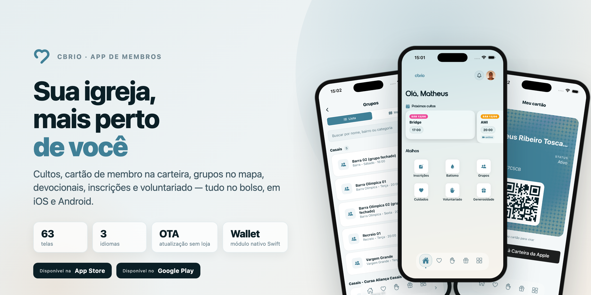
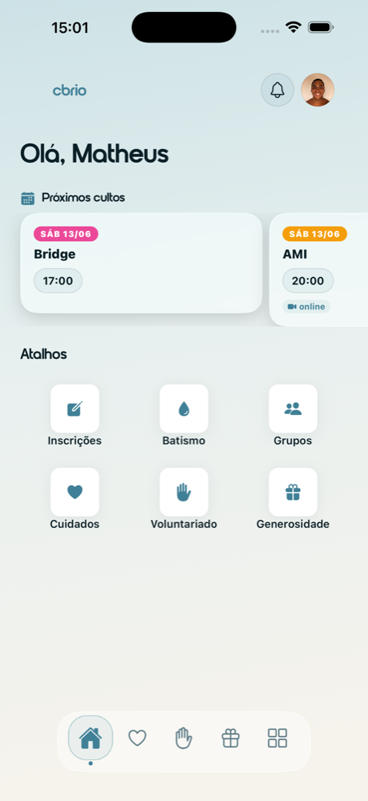
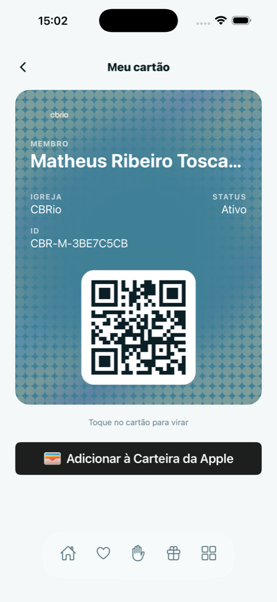
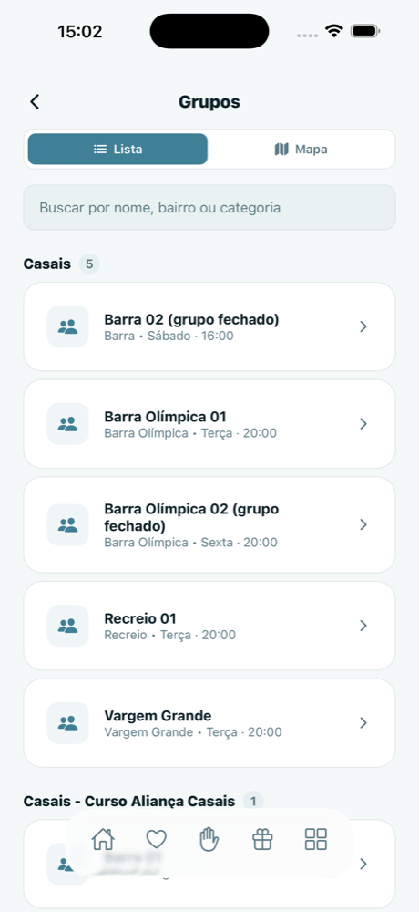
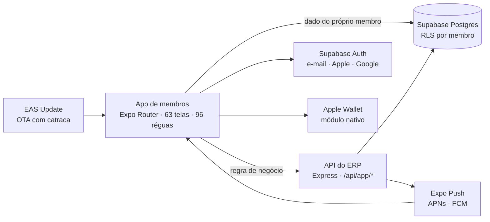

<p align="center">
  <picture>
    <source media="(prefers-color-scheme: dark)" srcset="docs/readme/hero-dark.png">
    
  </picture>
</p>

<h1 align="center">Aplicativo CBRio</h1>

<p align="center">
  O app dos membros da <a href="https://www.cbrio.org">Comunidade Batista do Rio de Janeiro</a>, em iOS e Android.<br>
  Cultos, cartão de membro na carteira, grupos no mapa, devocionais, inscrições e voluntariado — tudo no bolso.
</p>

<p align="center">
  <a href="https://apps.apple.com/br/app/cbrio/id6778156310"></a>
  <a href="https://play.google.com/store/apps/details?id=br.com.cbrio.app"></a>
  <a href="https://github.com/igreja-cbrio/Aplicativo-CBRio/actions/workflows/ci.yml"></a>
  
  
</p>

<p align="center">
  <a href="#o-que-o-app-faz">O que o app faz</a> ·
  <a href="#engenharia">Engenharia</a> ·
  <a href="#arquitetura">Arquitetura</a> ·
  <a href="#stack">Stack</a> ·
  <a href="#como-rodar">Como rodar</a> ·
  <a href="#equipe">Equipe</a>
</p>

> **English summary.** The official members app of CBRio, a large Baptist church in Rio de Janeiro, live on the App Store and Google Play. Expo SDK 54 + React Native 0.81 + TypeScript, Supabase with row-level security, a native Swift/Kotlin module for the Apple Wallet member card, an iOS widget, over-the-air updates with a release gate, and three languages. It is the mobile face of the church's integrated ERP (a private repository), which owns every business rule.

---

## O que o app faz

<p align="center">
  
  &nbsp;
  
  &nbsp;
  
</p>

| Área | O que a pessoa faz |
|---|---|
| **Cultos** | Próximos cultos por dia e horário, modo culto com decisão de fé pelo app, vídeos e transmissão |
| **Cartão de membro** | QR Code para check-in e identificação, com passe na Carteira da Apple |
| **Grupos** | Lista e mapa dos grupos de conexão por bairro, inscrição, e a gestão completa para quem lidera: presença, agenda, pedidos, materiais |
| **Devocionais** | Bíblia, planos de leitura com ritmo próprio ou por calendário, vídeo embutido, anotações e mural |
| **Jornada** | Os cinco valores da igreja na vida da pessoa: batismo, Next, grupo, servir, generosidade |
| **Inscrições** | Batismo (com escolha da data), Next, eventos pagos e gratuitos, compartilhamento do link |
| **Cuidados** | Pedido de oração, aconselhamento, SOS, fale com a igreja |
| **Voluntariado** | Escalas, confirmação ou recusa pela notificação, check-in pelo supervisor, disponibilidade |
| **Kids** | Vínculo com os filhos e pré-check-in |
| **Conta** | Cadastro completo com prova de posse, biometria, três idiomas, tema claro e escuro, notificações |

O módulo de **generosidade** (dízimos e ofertas por Pix e cartão, com comprovantes) está construído e desligado por *feature flag* até a conta de pagamentos da igreja ser homologada.

## Engenharia

- **O app é cliente, não régua.** Quem decide o que é válido (turma aberta, status de inscrição, quem gerencia um grupo) é a API do ERP. O app lê o banco direto só para o que é dado do próprio membro, protegido por RLS e por *grants* explícitos por coluna.
- **Atualização OTA com catraca.** Mudanças em JavaScript chegam por `expo-updates` sem passar pela loja; um arquivo de verdade registra qual binário está publicado em cada loja e um script recusa publicar OTA que o binário não alcança. Mudança nativa só sai por build de loja.
- **Módulo nativo próprio** em Swift e Kotlin para o passe do cartão de membro na Carteira da Apple (PassKit), mais um **widget iOS** em Swift via `@bacons/apple-targets`.
- **Réguas puras com teste de mutação.** A lógica que o app precisa reproduzir (fuso da igreja, janelas de data, estados de inscrição, o que é dia de culto) vive em `lib/*`, coberta por Vitest e por um script de mutantes que falha se a regra for afrouxada.
- **Fuso explícito.** Dia de operação é o de Brasília; `new Date('YYYY-MM-DD')` nunca é usado para data de calendário, porque no Rio é 21h do dia anterior.
- **Portão de identidade.** Entrar no app exige cadastro completo; quem já é da casa entra por CPF com código enviado ao contato que já está no cadastro. CPF identifica, não autentica.
- **Notificações com ação.** Confirmar ou recusar escala e aprovar pedido de grupo direto do card da notificação, passando pelo mesmo serviço do ERP.
- **Telemetria sem PII**: eventos, telas e erros com lista fechada de propriedades, lidos num painel do ERP.

## Arquitetura



## Stack

| Camada | Tecnologias |
|---|---|
| App | Expo SDK 54 · React Native 0.81 · React 19 · Expo Router 6 · TypeScript |
| Nativo | Swift e Kotlin (módulo Apple Wallet) · widget iOS · `expo-local-authentication` · `expo-notifications` |
| Dados | Supabase (Postgres com RLS, Auth, Storage) · API do ERP |
| Mapa | MapLibre |
| Entrega | EAS Build e Submit · EAS Update (OTA) · GitHub Actions |
| Qualidade | Vitest · script de mutantes · `tsc --noEmit` |

Estado em outubro de 2026: v1.0.1 publicada na App Store (build 44, 21/09/2026) e no Google Play (versionCode 9, 16/09/2026) · 63 telas · 17 arquivos de teste · pt, en e es.

## Como rodar

```bash
npm install
cp .env.example .env     # credenciais do Supabase e URL da API
npm start                # depois "i" (iOS) ou "a" (Android)

npm run typecheck && npm test
```

Build de loja e OTA usam o EAS (`eas build`, `npm run ota`); a catraca de versões está em `loja-publicado.json`.

O app é o cliente do ERP da CBRio: fora da igreja ele abre, mas só carrega dados com um projeto Supabase que tenha o schema do ERP e com a API do ERP no ar.

## Projetos relacionados

- **Sistema Integrado CBRio** (repositório privado) — o ERP que este app consome: toda regra de negócio, a API e o banco.

## Equipe

- **Matheus Toscano** — gestão da CBRio; idealizou o app e é seu principal autor · [GitHub](https://github.com/mtoscano99)
- **Marcos Paulo Almeida** — engenharia; co-autor · [GitHub](https://github.com/MarcosPaulo1)

**Sobre IA.** Desenvolvido com Claude Code: os agentes escrevem boa parte do código a partir das especificações da equipe, e o que vai para a loja ou por OTA passa por typecheck, testes e pelo script de mutantes no CI.

## Licença

Código de propriedade da Igreja Comunidade Batista do Rio de Janeiro (CBRio). Todos os direitos reservados. Não é *open source*: nenhuma licença de uso, cópia, modificação ou distribuição é concedida. Marcas, fontes e demais assets de terceiros pertencem aos respectivos titulares e não são licenciados por este repositório. Veja [`LICENSE`](LICENSE).
